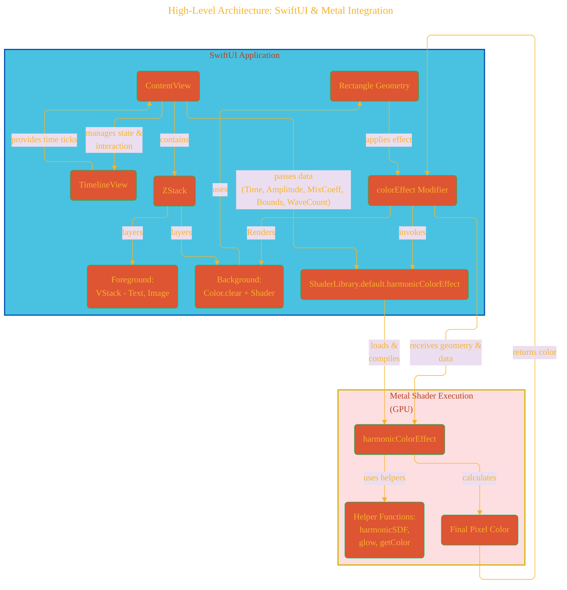
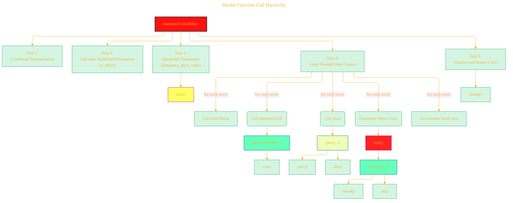
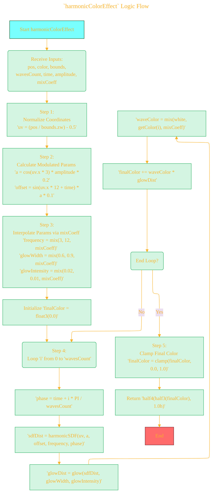
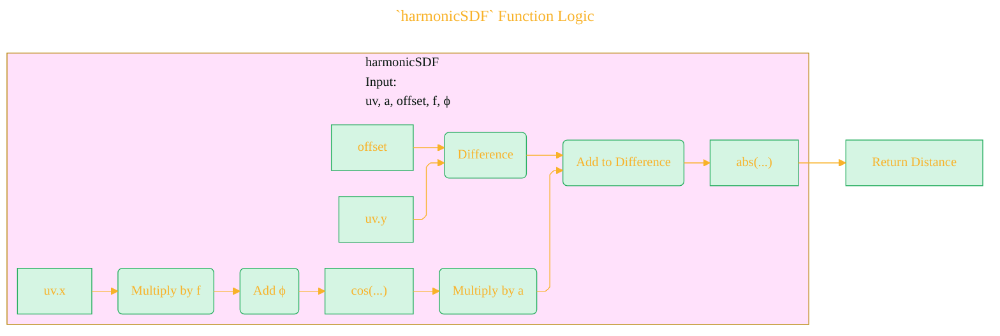
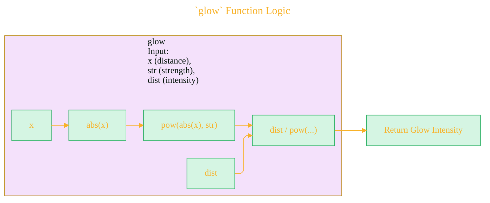
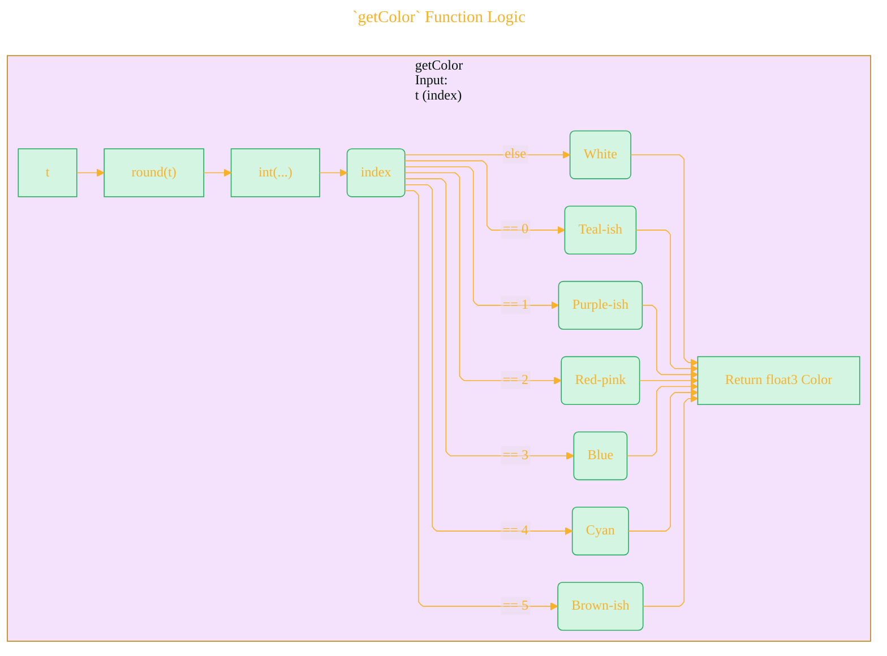
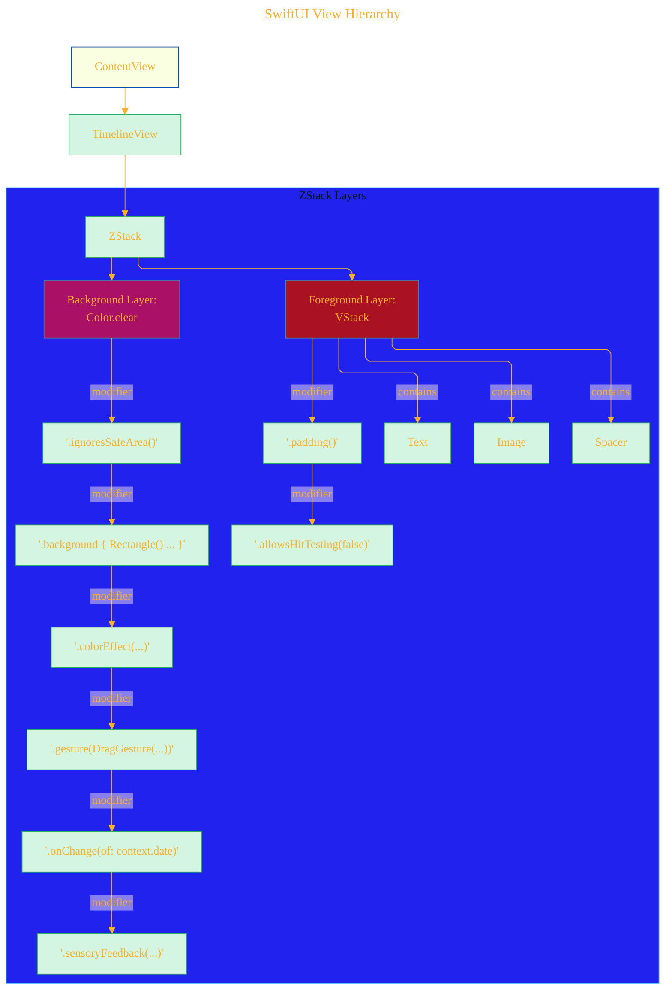
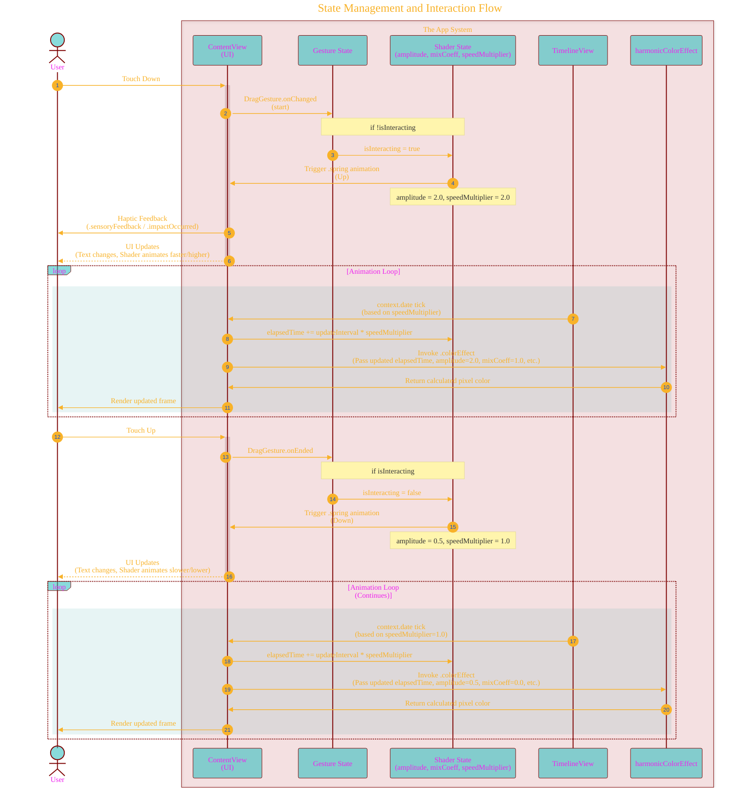
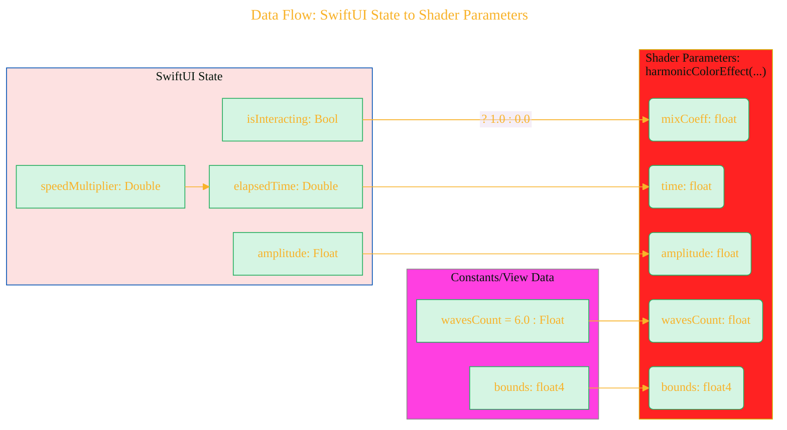

# A Diagrammatic Guide 
> **Disclaimer:**
>
> This document contains my personal notes on the topic,
> compiled from publicly available documentation and various cited sources.
> The materials are intended for educational purposes, personal study, and reference.
> The content is dual-licensed:
> 1. **MIT License:** Applies to all code implementations (Swift, Mermaid, and other programming languages).
> 2. **Creative Commons Attribution 4.0 International License (CC BY 4.0):** Applies to all non-code content, including text, explanations, diagrams, and illustrations.
---

# Overview

The provided code implements a dynamic, interactive visual effect using a Metal shader integrated into a SwiftUI view.

1.  **`HarmonicShaders.metal`**: Defines the GPU-side logic. It calculates multiple layers of harmonic (sine/cosine-like) waves, applies a glow effect, and colors them based on various parameters including time and an interaction coefficient.
2.  **`ContentView.swift`**: Defines the SwiftUI view that displays the shader effect. It sets up the shader, provides interactive controls (press and hold), manages animation timing, and passes necessary data (like time, amplitude, interaction state) to the shader.

Let's break down the components and interactions visually.

---


# 1. High-Level Architecture: SwiftUI & Metal Integration

This diagram shows the main components and how they connect.




**Explanation:**

*   The **SwiftUI Layer** manages the application's UI, state, and interaction. `ContentView` orchestrates this.
*   `TimelineView` drives the animation by providing regular time updates.
*   A `ZStack` layers a clear background (which hosts the shader via `.colorEffect` on a `Rectangle`) and the non-interactive foreground UI.
*   The `.colorEffect` modifier bridges SwiftUI and Metal, invoking the `harmonicColorEffect` shader function from the `ShaderLibrary`.
*   Crucially, `ContentView` passes dynamic data (elapsed time, interaction state formatted as `mixCoeff`, amplitude, etc.) to the shader on each render pass.
*   The **Metal Layer** executes the `harmonicColorEffect` shader function on the GPU, using helper functions to calculate the final color for each pixel based on the input data.
*   The resulting color is sent back to the `.colorEffect` modifier to be displayed in the background layer.

----

# 2. Metal Shader (`HarmonicShaders.metal`) Breakdown

## 2.1. Shader Function Call Hierarchy

This shows how the main `harmonicColorEffect` relies on helper functions.



**Explanation:**

*   The main shader (`harmonicColorEffect`) orchestrates the process.
*   It calls standard Metal functions like `mix`, `cos`, `pow`, `abs`, `clamp`, `round`, `int`.
*   It heavily relies on the custom helper functions:
    *   `harmonicSDF`: To calculate the distance to each wave.
    *   `glow`: To determine the brightness based on distance.
    *   `getColor`: To select a color for each wave layer (when interacting).

## 2.2. `harmonicColorEffect` Logic Flow
## TODO: Break down this section into small parts to further explain the math equation using LaTex syntax
This flowchart details the steps inside the main shader function.



**Explanation:**

*   The shader takes input parameters from SwiftUI.
*   Coordinates are normalized to a standard [-0.5, 0.5] range centered at (0,0).
*   Base wave amplitude (`a`) and vertical offset (`offset`) are calculated based on the pixel's horizontal position (`uv.x`), creating inherent spatial variation.
*   Key visual parameters (`frequency`, `glowWidth`, `glowIntensity`) are interpolated between two states (e.g., 'released' vs 'pressed') using the `mixCoeff` provided by SwiftUI.
*   The core logic iterates through the specified number of `wavesCount`.
*   Inside the loop:
    *   Each wave gets a unique `phase` based on time and its layer index `i`, making them distinct and animated.
    *   `harmonicSDF` calculates the distance to the wave.
    *   `glow` converts distance into brightness.
    *   The wave's color is determined, interpolating between white and a palette color based on `mixCoeff`.
    *   The glowing color is added to the `finalColor`.
*   Finally, the accumulated color is clamped and returned as a `half4`.

## 2.3. `harmonicSDF` Function Logic



**Explanation:** This calculates `abs((uv.y - offset) + cos(uv.x * f + phi) * a)`. It finds the vertical difference between the pixel's y-position (`uv.y`) and the wave's calculated y-position at that x (`offset - cos(...) * a`). The `abs` gives the shortest distance to the wave curve.

## 2.4. `glow` Function Logic



**Explanation:** This calculates `dist / pow(abs(x), str)`. Intensity decreases inversely with the distance (`x`) raised to the power of `str`. Higher `str` means faster falloff (tighter glow).

## 2.5. `getColor` Function Logic



**Explanation:** This function acts as a simple lookup table, mapping an integer index (derived from the float input `t`) to a specific hardcoded `float3` RGB color. It includes a default white fallback.

---

# 3. SwiftUI (`ContentView.swift`) Breakdown

## 3.1. View Hierarchy



**Explanation:**

*   The core is a `TimelineView` driving updates.
*   A `ZStack` manages layering:
    *   **Background:** An invisible `Color.clear` fills the screen. It has modifiers to:
        *   Ignore safe areas.
        *   Draw the `Rectangle` with the `.colorEffect` shader in its background.
        *   Attach the `DragGesture` for interaction.
        *   Observe time changes (`.onChange`).
        *   Provide haptic feedback (`.sensoryFeedback`).
    *   **Foreground:** A `VStack` containing the visible elements (`Text`, `Image`). Crucially, `.allowsHitTesting(false)` ensures touches pass through to the background gesture recognizer.

## 3.2. State Management and Interaction Flow

This sequence diagram illustrates the press-and-hold interaction.




**Explanation:**

1.  **Touch Down:** User presses the screen. The `DragGesture`'s `onChanged` fires.
2.  **State Change (Press):** `isInteracting` becomes `true`. A spring animation starts, increasing `amplitude` and `speedMultiplier`. Haptic feedback occurs.
3.  **Animation Loop (Pressed):** `TimelineView` provides ticks more frequently (due to `speedMultiplier=2.0`). `elapsedTime` increases faster. The shader receives `amplitude=2.0` and `mixCoeff=1.0`, resulting in the "active" visual state (higher frequency, different color mix, tighter glow).
4.  **Touch Up:** User releases the screen. The `DragGesture`'s `onEnded` fires.
5.  **State Change (Release):** `isInteracting` becomes `false`. A spring animation starts, decreasing `amplitude` and `speedMultiplier` back to baseline.
6.  **Animation Loop (Released):** `TimelineView` ticks at the normal rate (`speedMultiplier=1.0`). `elapsedTime` increases normally. The shader receives `amplitude=0.5` and `mixCoeff=0.0`, resulting in the "resting" visual state (lower frequency, white waves, wider glow).

## 3.3. Data Flow: SwiftUI State to Shader Parameters



**Explanation:**

*   SwiftUI state variables (`elapsedTime`, `amplitude`, `isInteracting`) directly influence the parameters passed to the `harmonicColorEffect` shader.
*   `speedMultiplier` indirectly affects the `time` parameter by controlling how fast `elapsedTime` increases.
*   The boolean `isInteracting` is converted to a float `mixCoeff` (0.0 or 1.0) for use in the shader's `mix` functions.
*   The number of waves is passed as a constant float.
*   The view's bounding rectangle (`bounds`) is provided for coordinate normalization within the shader.


----


```mermaid
---
title: "CongLeSolutionX"
author: "Cong Le"
version: "1.0"
license(s): "MIT, CC BY 4.0"
copyright: "Copyright (c) 2025 Cong Le. All Rights Reserved."
config:
  theme: base
---
%%%%%%%% Mermaid version v11.4.1-b.14
%%{
  init: {
    'flowchart': { 'htmlLabels': false },
    'fontFamily': 'Brush Script MT',
    'themeVariables': {
      'primaryColor': '#fc82',
      'primaryTextColor': '#F8B229',
      'primaryBorderColor': '#27AE60',
      'secondaryColor': '#81c784',
      'secondaryTextColor': '#6C3483',
      'lineColor': '#F8B229',
      'fontSize': '20px'
    }
  }
}%%
flowchart LR
    My_Meme@{ img: "https://github.com/CongLeSolutionX/MY_GRAPHIC_ASSETS/blob/Designing_graphic_syntax/MY_MEME_ICONS/Orange-Cloud-Search-Icon-Base-Color-Black-1024x1024.png?raw=true", label: "Ăn uống gì chưa ngừi đẹp?", pos: "b", w: 200, h: 150, constraint: "on" }

    Closing_quote@{ shape: braces, label: "Math and code work together to bring interactive art to life!" }

Closing_quote --- My_Meme

```


---
**Licenses:**

- **MIT License:**  [](LICENSE) - Full text in [LICENSE](LICENSE) file.
- **Creative Commons Attribution 4.0 International:** [](LICENSE-CC-BY) - Legal details in [LICENSE-CC-BY](LICENSE-CC-BY) and at [Creative Commons official site](http://creativecommons.org/licenses/by/4.0/).

---