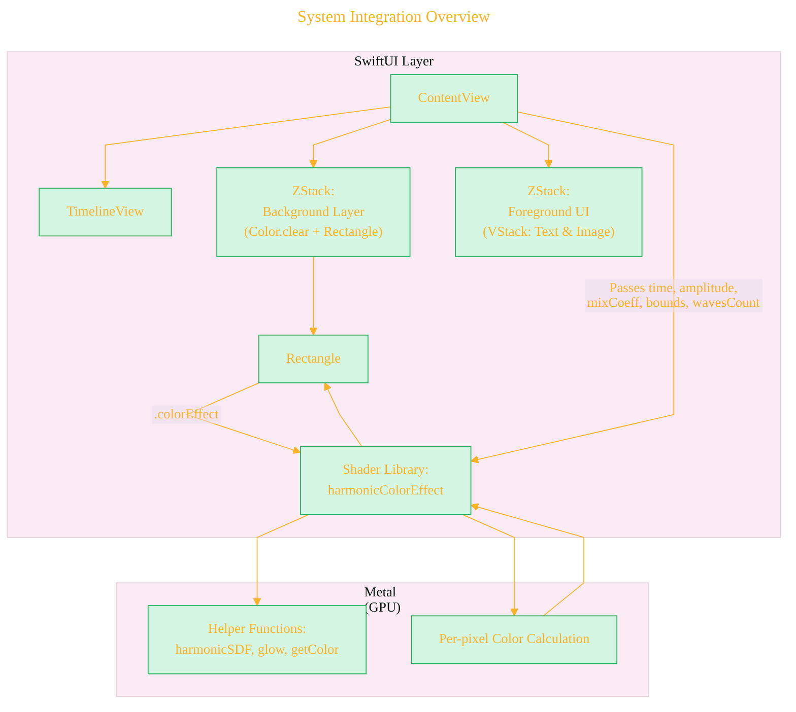
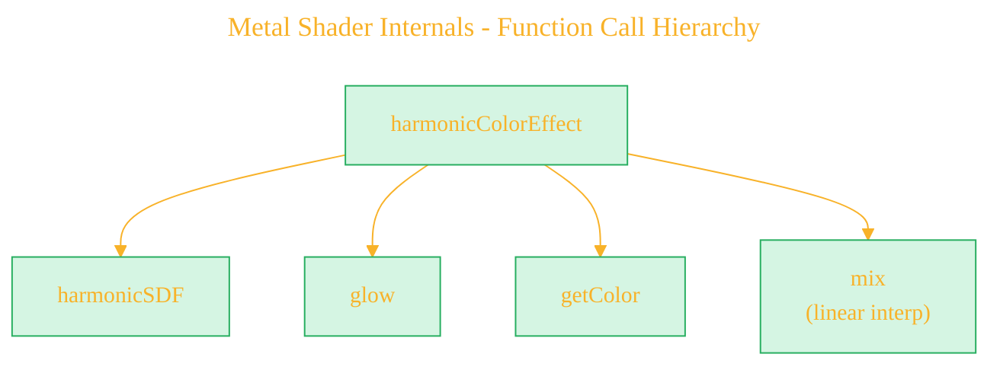
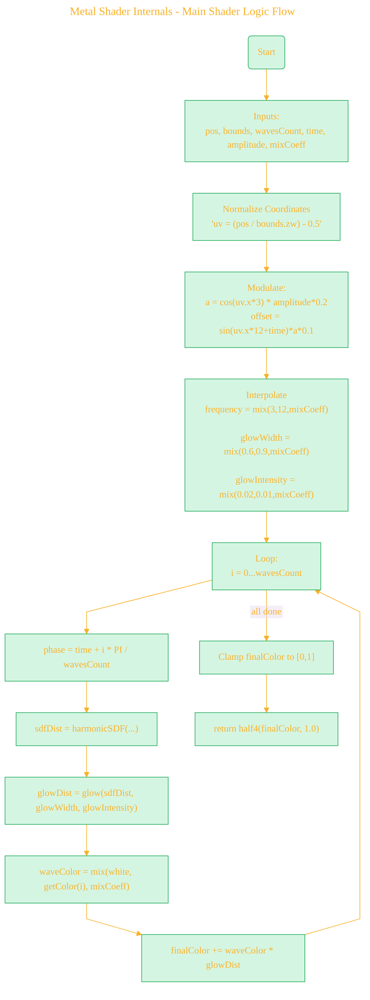
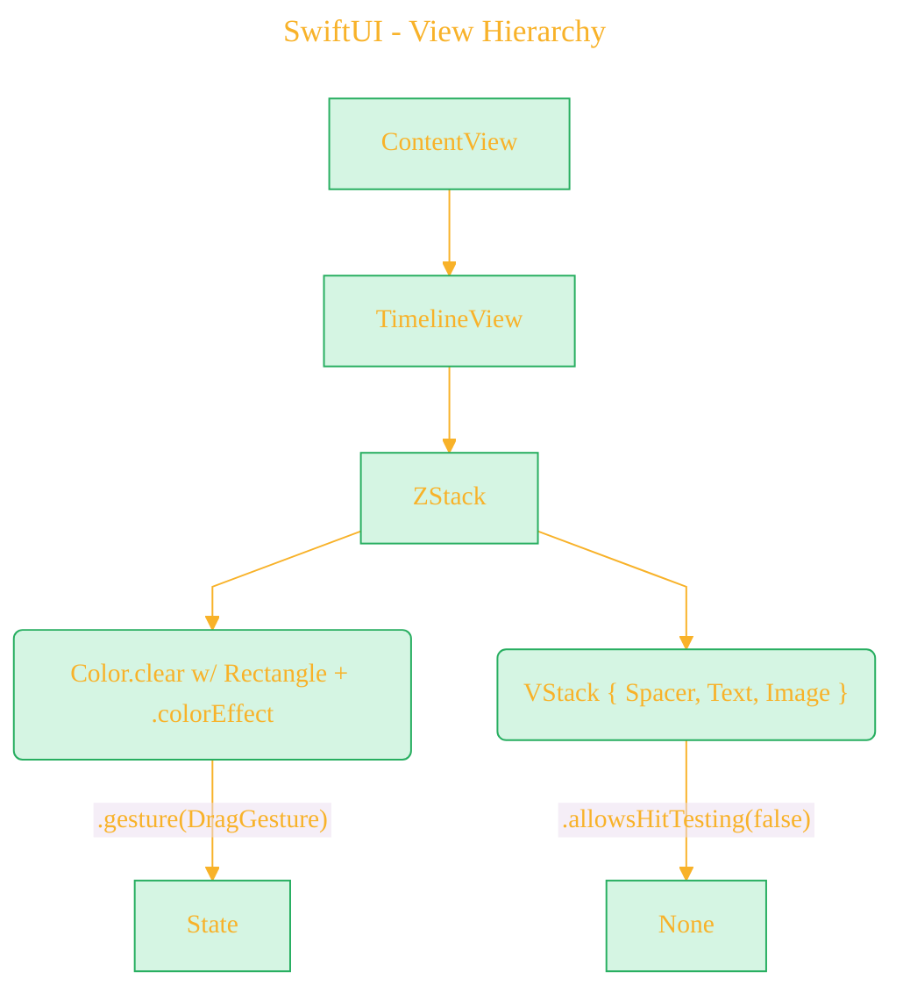
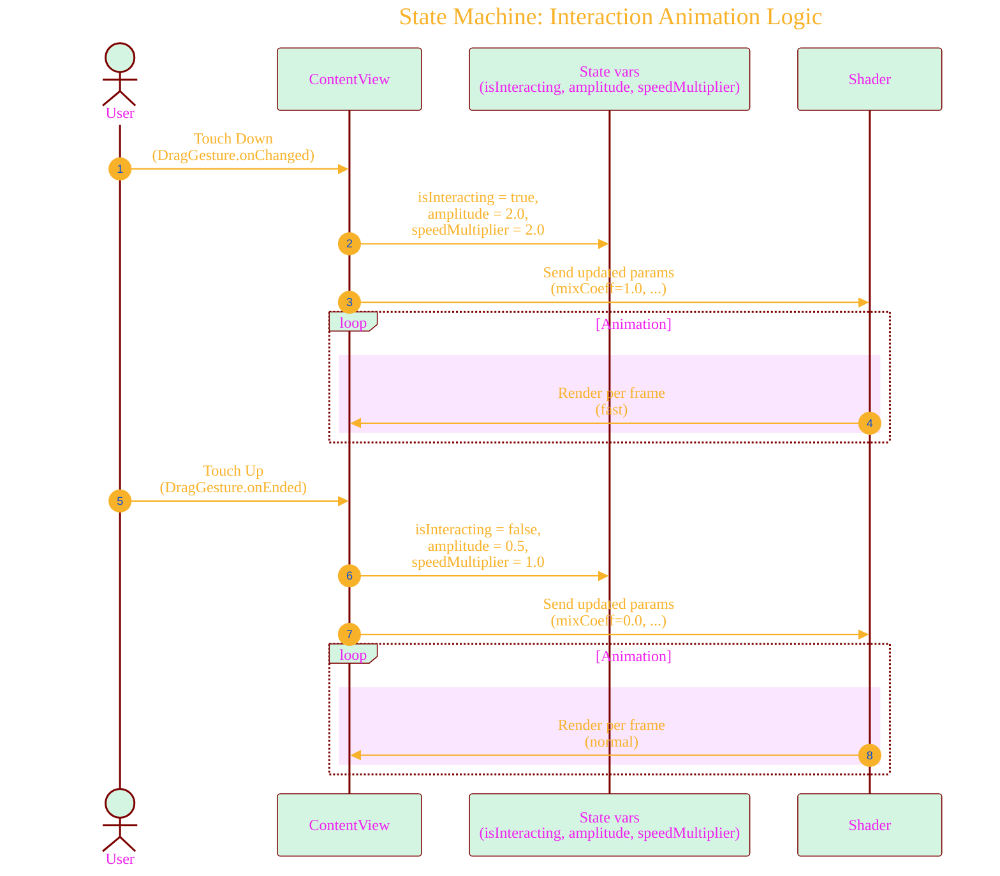
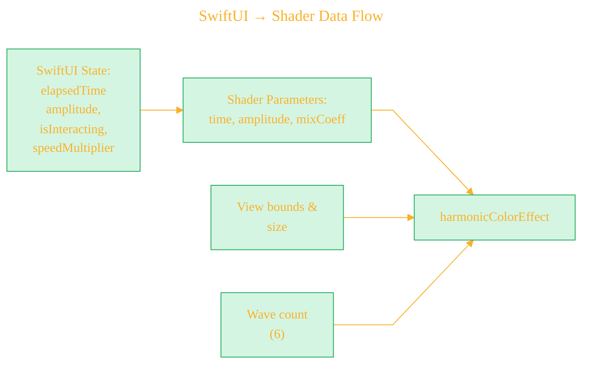
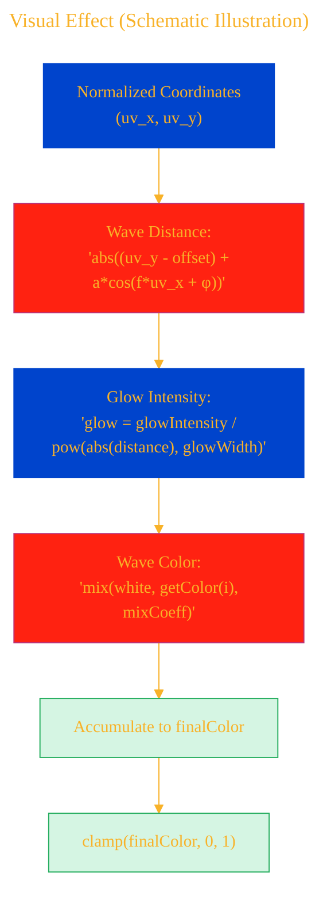
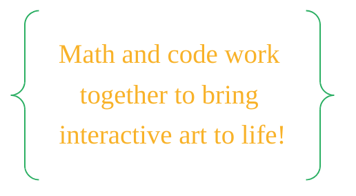

# A Diagrammatic Guide
> **Disclaimer:**
>
> This document contains my personal notes on the topic,
> compiled from publicly available documentation and various cited sources.
> The materials are intended for educational purposes, personal study, and reference.
> The content is dual-licensed:
> 1. **MIT License:** Applies to all code implementations (Swift, Mermaid, and other programming languages).
> 2. **Creative Commons Attribution 4.0 International License (CC BY 4.0):** Applies to all non-code content, including text, explanations, diagrams, and illustrations.
---


# Visual & Mathematical Illustration of Interactive Metal Shader SwiftUI App

This guide offers a comprehensive visual and mathematical explanation of the dynamic harmonic Metal shader powered by SwiftUI. It combines **Mermaid diagrams** for structural and process illustration with **LaTeX-formatted mathematics** to clarify the equations and concepts underpinning the visual effect.

---

## 1. High-Level Application Structure

### a. System Integration Overview



**Key Concepts:**
- **SwiftUI Layer:** Orchestrates state management, time progression, and user interaction.
- **Metal Layer:** The shader function computes per-pixel color, blending multiple harmonic waves modulated by time, position, and interaction state, using several helper functions.
- **Data Passing:** Dynamic parameters are sent from SwiftUI to Metal each frame.

---

## 2. Metal Shader Internals

### a. Function Call Hierarchy



### b. Main Shader Logic Flow




---

### c. Helper Functions (Mathematics and Visuals)

#### 1. harmonicSDF
**Purpose:** Compute the *vertical* distance from a pixel to a modulated harmonic curve.

$$
\text{SDF}(uv, a, \text{offset}, f, \varphi) = \left|\left(uv_y - \text{offset}\right) + a \cdot \cos(f\, uv_x + \varphi) \right|
$$

- $uv = (uv_x, uv_y)$: Normalized and centered pixel coordinates ($-0.5 \leq uv_x, uv_y \leq 0.5$)
- $a$: Pixel-specific amplitude modulator
- $\text{offset}$: Pixel-specific vertical offset
- $f$: Frequency (number of wave cycles)
- $\varphi$: Phase shift

#### 2. glow

**Purpose:** Maps distance from the wave to a *brightness* (for glow).

$$
\text{glow}(x, \mathrm{str}, d) = \frac{d}{|x|^{\mathrm{str}}}
$$

- $x$: SDF distance
- $\mathrm{str}$: "Glow width" (exponent for power-law drop-off)
- $d$: Glow base intensity

Visual: Small $|x| \implies$ high brightness, larger  $|x| \implies$ rapid dimming.

#### 3. getColor

A simple hardcoded palette:

$$
\text{getColor}(i) = 
\begin{cases}
\text{Teal} & \text{if } i=0 \\
\text{Purple} & \text{if } i=1 \\
\text{Red-pink} & \text{if } i=2 \\
\text{Blue} & \text{if } i=3 \\
\text{Cyan} & \text{if } i=4 \\
\text{Brown} & \text{if } i=5 \\
\text{White} & \text{default}
\end{cases}
$$

#### 4. mix (linear interpolation)

For parameter interpolation:

$$
\text{mix}(a, b, t) = a \cdot (1-t) + b \cdot t
$$

Used to smoothly transition between "rest" and "press" states.

---

## 3. SwiftUI: UI Structure + State Management

### a. View Hierarchy





### b. State Machine: Interaction Animation Logic



**In words:**
- **Press:** Amplitude grows, frequency increases, glow tightens, color shifts from white → palette color. Animation speeds up.
- **Release:** All params "relax" to baseline.

---

### c. SwiftUI → Shader Data Flow


- SwiftUI reacts to user input, updating state, which recalculates and sends parameters to Metal for real-time graphics.

---

## 4. Core Mathematical Equations (with Notation Explanation)

### A. Coordinate Normalization

$$
uv = \frac{\text{pos}}{(\text{width}, \text{height})} - (0.5, 0.5)
$$
where:
- $\text{pos}$: Pixel position (raw coordinates)
- $(\text{width}, \text{height})$: View's size

### B. Local Amplitude and Offset
$$
\begin{align*}
a & = \cos(uv_x \cdot 3) \cdot \text{amplitude} \cdot 0.2 \\
\text{offset} & = \sin(uv_x \cdot 12 + t) \cdot a \cdot 0.1
\end{align*}
$$
where $t$ is the animation time, $\text{amplitude}$ is set by user state.

### C. Frequency, Glow, and Intensity Interpolation

$$
\begin{align*}
\text{frequency} & = \text{mix}(3, 12, \text{mixCoeff}) \\
\text{glowWidth} & = \text{mix}(0.6, 0.9, \text{mixCoeff}) \\
\text{glowIntensity} & = \text{mix}(0.02, 0.01, \text{mixCoeff})
\end{align*}
$$

### D. Wave Layer Loop
For each wave \(i = 0, 1, ... N-1\):

$$
\begin{align*}
\phi_i & = t + i \cdot \frac{\pi}{N} \\
\text{dist}_i & = \left| (uv_y - \text{offset}) + a \cdot \cos(\text{frequency} \cdot uv_x + \phi_i) \right| \\
\text{glow}_i & = \frac{\text{glowIntensity}}{ |\text{dist}_i|^{\text{glowWidth}}} \\
\text{color}_i & = \text{mix}(\textbf{1}, \text{getColor}(i), \text{mixCoeff}) \\
\end{align*}
$$

Accumulate:
$$
\text{finalColor} \mathrel{+}= \text{color}_i \cdot \text{glow}_i
$$

After loop:

$$
\text{finalColor} = \text{clamp}(\text{finalColor}, 0, 1)
$$


---

## 5. Visual & Interaction Summary

- **Idle:** Waves are white, low frequency (gentle), wide glow (soft/fuzzy), slow animation.
- **Pressed:** Waves become colored, frequency/high, tight glow, fast animation.
- **Transition:** All parameters interpolate smoothly between the two states using the `mixCoeff`.

---

### Summary Table: Parameter Mapping

| User State   | amplitude | frequency | glowWidth | glowIntensity | color             | speed        |
|--------------|-----------|-----------|-----------|---------------|-------------------|--------------|
| Idle         |   0.5     |    3      |  0.6      |   0.02        | white             | 1.0x         |
| Interacting  |   2.0     |   12      |  0.9      |   0.01        | palette color     | 2.0x         |
| Transition   |  mix      |   mix     |  mix      |   mix         | mix               | animating    |

---

## 6. Visual Effect (Schematic Illustration)




---

## 7. Takeaway

This architecture demonstrates **state-driven, GPU-accelerated, interactive animation** using SwiftUI and Metal in harmony. The visuals are not static—they are shaped in real time through mathematical equations and user touch, with every parameter and color calculated per pixel for beautifully smooth and performant effects.





```mermaid
---
title: "CongLeSolutionX"
author: "Cong Le"
version: "1.0"
license(s): "MIT, CC BY 4.0"
copyright: "Copyright (c) 2025 Cong Le. All Rights Reserved."
config:
  theme: base
---
%%%%%%%% Mermaid version v11.4.1-b.14
%%{
  init: {
    'flowchart': { 'htmlLabels': false },
    'fontFamily': 'Brush Script MT',
    'themeVariables': {
      'primaryColor': '#fc82',
      'primaryTextColor': '#F8B229',
      'primaryBorderColor': '#27AE60',
      'secondaryColor': '#81c784',
      'secondaryTextColor': '#6C3483',
      'fontSize': '15px'
    }
  }
}%%
flowchart TD
    My_Meme@{ img: "https://github.com/CongLeSolutionX/MY_GRAPHIC_ASSETS/blob/Designing_graphic_syntax/MY_MEME_ICONS/Orange-Cloud-Search-Icon-Base-Color-Black-1024x1024.png?raw=true", label: "Ăn uống gì chưa ngừi đẹp?", pos: "b", w: 200, h: 150, constraint: "on" }

```


----


## References

- [Metal Shading Language Specification (Apple Docs)](https://developer.apple.com/metal/Metal-Shading-Language-Specification.pdf)
- [SwiftUI ShaderLibrary Documentation](https://developer.apple.com/documentation/swiftui/shaderlibrary)
- Harmonic SDF equations inspired by standard distance field and procedural graphics techniques.


---
**Licenses:**

- **MIT License:**  [](LICENSE) - Full text in [LICENSE](LICENSE) file.
- **Creative Commons Attribution 4.0 International:** [](LICENSE-CC-BY) - Legal details in [LICENSE-CC-BY](LICENSE-CC-BY) and at [Creative Commons official site](http://creativecommons.org/licenses/by/4.0/).

---