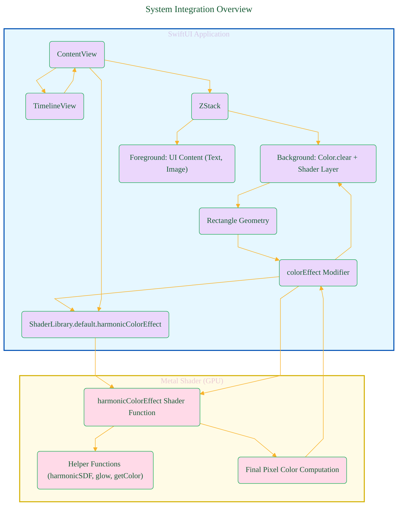
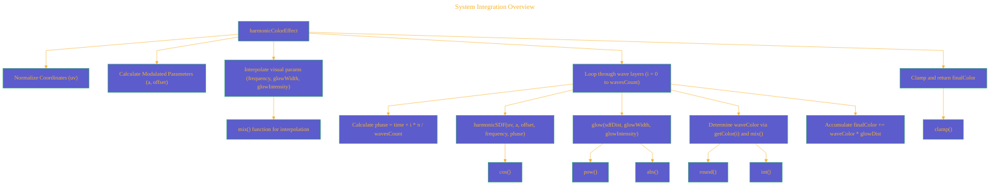
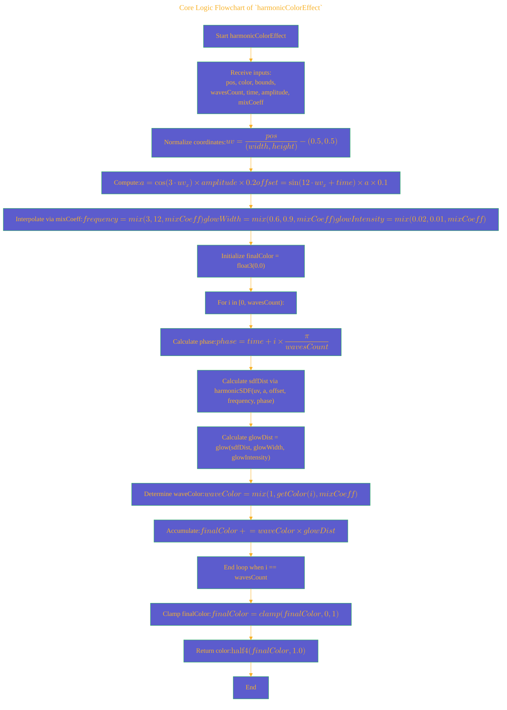
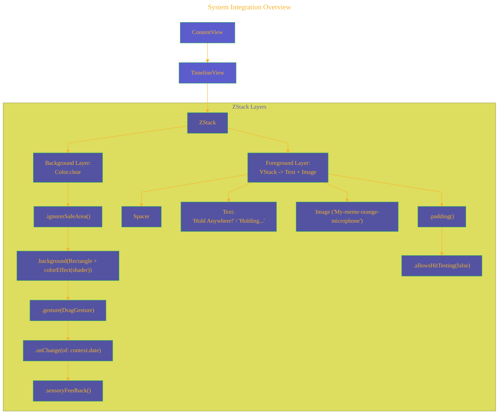
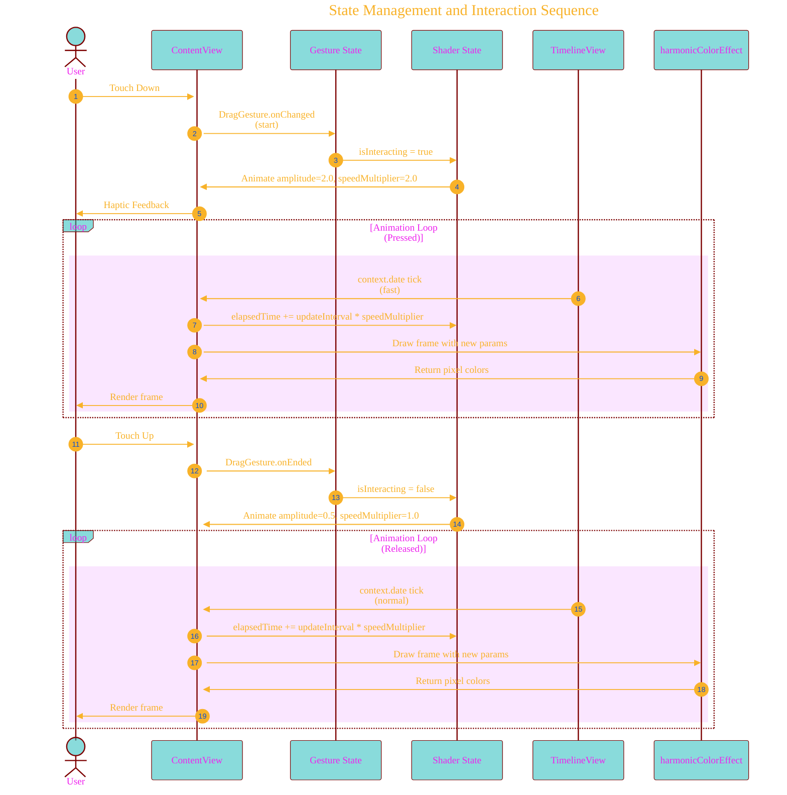
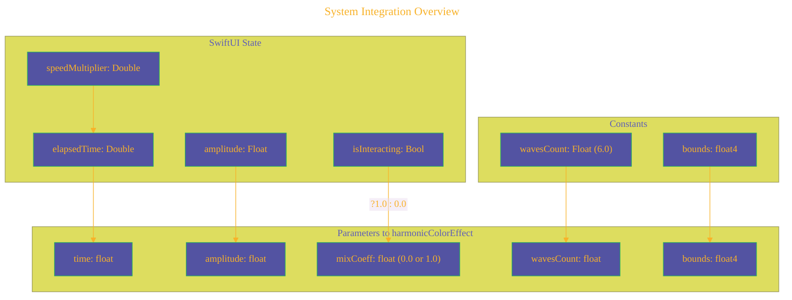
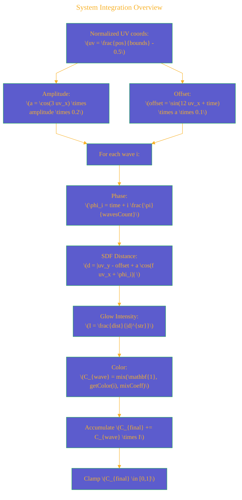

# A Diagrammatic Guide 
> **Disclaimer:**
>
> This document contains my personal notes on the topic,
> compiled from publicly available documentation and various cited sources.
> The materials are intended for educational purposes, personal study, and reference.
> The content is dual-licensed:
> 1. **MIT License:** Applies to all code implementations (Swift, Mermaid, and other programming languages).
> 2. **Creative Commons Attribution 4.0 International License (CC BY 4.0):** Applies to all non-code content, including text, explanations, diagrams, and illustrations.
---


# Visual and Mathematical Explanation of the Harmonic Shader Architecture and Implementation

This document provides a detailed understanding of a dynamic harmonic wave effect implemented using Metal shaders integrated into SwiftUI. Below are the explanations through Mermaid diagrams and LaTeX-rendered math expressions highlighting the mechanism, data flow, and mathematical formulations involved.

---

## 1. High-Level Architecture: SwiftUI & Metal Integration



**Explanation:**

* The **SwiftUI Layer** handles the UI, interaction, and animation timing.
* `TimelineView` provides time ticks, enabling continuous animation.
* A `ZStack` arranges layers: a transparent background hosting the shader and a foreground UI.
* `colorEffect` modifier bridges SwiftUI and the Metal shader function `harmonicColorEffect`.
* The **Metal Layer** executes on GPU, computing pixel colors using harmonic wave functions and glow effects.

---

## 2. Shader Function Call Hierarchy & Logic Flow

### 2.1. Function Call Hierarchy



### 2.2. Core Logic Flowchart of `harmonicColorEffect`



---

## 3. Mathematical Descriptions of Core Shading Functions

### 3.1 Harmonic Signed Distance Function (`harmonicSDF`)

Calculates the unsigned distance from a pixel coordinate to the position on the harmonic wave.

$$
\begin{aligned}
\text{harmonicSDF}(\mathbf{uv}, a, \text{offset}, f, \phi) &= \left| y - \text{offset} + a \cos(f x + \phi) \right| \\
&= \left| (uv_y - \text{offset}) + a \cos(f \, uv_x + \phi) \right|
\end{aligned}
$$

where
- $\mathbf{uv} = (uv_x, uv_y)$ are normalized coordinates centered at (0,0),
- $a$ is modulated amplitude,
- $\text{offset}$ is vertical offset,
- $f$ is spatial frequency,
- $\phi$ is phase shift.

### 3.2 Glow Intensity Function (`glow`)

Computes glowing intensity inversely proportional to distance raised to a strength exponent.

$$
\text{glow}(x, str, dist) = \frac{dist}{|x|^{str}}
$$

where
- $x$ is distance (from `harmonicSDF`),
- $str$ controls falloff steepness,
- $dist$ is base intensity scaling.

### 3.3 Color Lookup Function (`getColor`)

Maps an integer index $t$ to a fixed RGB color vector $\mathbf{c}\in\mathbb{R}^3$, i.e.,

$$
\text{getColor}(t) = \mathbf{c}_t = 
\begin{cases}
(0.482, 0.831, 0.855), & t = 0 \quad (\text{Teal-ish}) \\
(0.412, 0.412, 0.847), & t = 1 \quad (\text{Purple-ish}) \\
(0.941, 0.314, 0.412), & t = 2 \quad (\text{Red-pink}) \\
(0.275, 0.490, 0.941), & t = 3 \quad (\text{Blue}) \\
(0.078, 0.863, 0.863), & t = 4 \quad (\text{Cyan}) \\
(0.784, 0.627, 0.549), & t = 5 \quad (\text{Brown-ish}) \\
(1.0, 1.0, 1.0), & \text{otherwise (default white)}
\end{cases}
$$

---

## 4. SwiftUI View Layer Hierarchy



**Explanation:**

* Background hosts the shader and gesture handlers.
* Foreground displays UI text and image with hit testing disabled to pass touches through to background.

---

## 5. State Management and Interaction Sequence



---

## 6. Data Flow: From SwiftUI State to Shader Parameters



**Explanation:**

* SwiftUI state variables control the animation timing and effect strength.
* `isInteracting` boolean converts to a float coefficient driving interpolation in the shader.

---

# Summary of Key Mathematical Equations

| Concept                   | Equation                                                                                                       | Explanation                                 |     |     |
| ------------------------- | -------------------------------------------------------------------------------------------------------------- | ------------------------------------------- | --- | --- |
| Coordinate Normalization  | $\displaystyle uv = \frac{pos}{(W, H)} - (0.5, 0.5)$                                                           | Transforms pixel pos to [-0.5, 0.5] range   |     |     |
| Harmonic SDF              | \displaystyle d = \left(uv_y - offset) + a \cos(f uv_x + \phi) \right\)                                        | Distance to harmonic wave curve             |     |     |
| Glow Intensity            | $\displaystyle I = \frac{dist}{x^{str}}$                                                                       | Intensity falls with powered distance       |     |     |
| Color Interpolation (mix) | $\displaystyle C_{wave} = (1 - mixCoeff) \times \mathbf{1} + mixCoeff \times getColor(i)$                      | Interpolates from white to palette color    |     |     |
| Phase for Wave $i$        | $\displaystyle \phi_i = time + i \times \frac{\pi}{wavesCount}$                                                | Phase shift for animation per wave          |     |     |
| Final Color Accumulation  | $\displaystyle C_{final} = \mathrm{clamp}\left(\sum_{i=0}^{wavesCount - 1} C_{wave_i} \times I_i, 0, 1\right)$ | Sum color contributions with glow and clamp |     |     |

---

# Visual Summary




---

# Conclusion

This visual and mathematical overview reveals how:

- SwiftUI coordinates UI and input states with GPU-accelerated Metal shaders.
- The shader implements a layered harmonic wave effect based on sine and cosine functions with dynamic amplitude, phase, offset and glow effects.
- Interaction modulates wave parameters smoothly impacting frequency, glow sharpness, amplitude, and colors.
- Efficient GPU computation enables real-time visual responsiveness to touch input.


---


```mermaid
---
title: "CongLeSolutionX"
author: "Cong Le"
version: "1.0"
license(s): "MIT, CC BY 4.0"
copyright: "Copyright (c) 2025 Cong Le. All Rights Reserved."
config:
  theme: base
---
%%%%%%%% Mermaid version v11.4.1-b.14
%%{
  init: {
    'flowchart': { 'htmlLabels': false },
    'fontFamily': 'Brush Script MT',
    'themeVariables': {
      'primaryColor': '#fc82',
      'primaryTextColor': '#F8B229',
      'primaryBorderColor': '#27AE60',
      'secondaryColor': '#81c784',
      'secondaryTextColor': '#6C3483',
      'fontSize': '20px'
    }
  }
}%%
flowchart LR
    My_Meme@{ img: "https://github.com/CongLeSolutionX/MY_GRAPHIC_ASSETS/blob/Designing_graphic_syntax/MY_MEME_ICONS/Orange-Cloud-Search-Icon-Base-Color-Black-1024x1024.png?raw=true", label: "Ăn uống gì chưa ngừi đẹp?", pos: "b", w: 200, h: 150, constraint: "on" }

    Closing_quote@{ shape: braces, label: "Math and code work together to bring interactive art to life!" }

Closing_quote --- My_Meme

```


---
**Licenses:**

- **MIT License:**  [](LICENSE) - Full text in [LICENSE](LICENSE) file.
- **Creative Commons Attribution 4.0 International:** [](LICENSE-CC-BY) - Legal details in [LICENSE-CC-BY](LICENSE-CC-BY) and at [Creative Commons official site](http://creativecommons.org/licenses/by/4.0/).

---