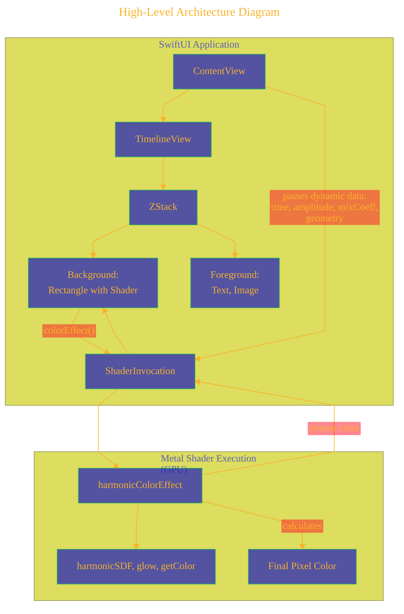
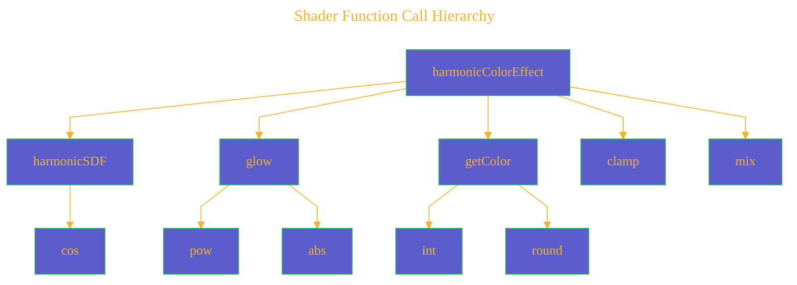
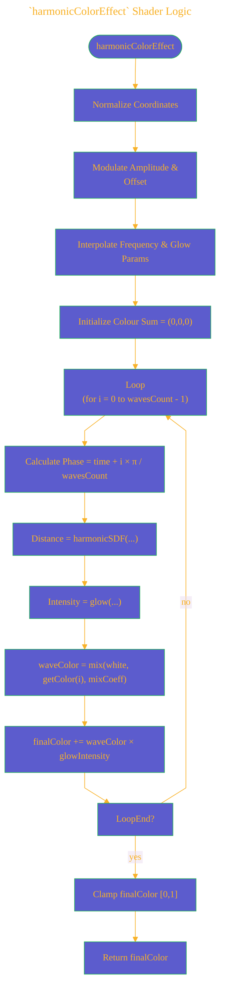
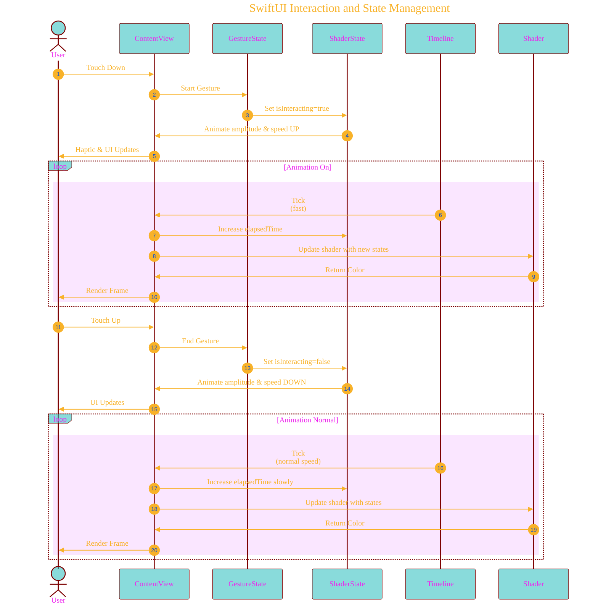
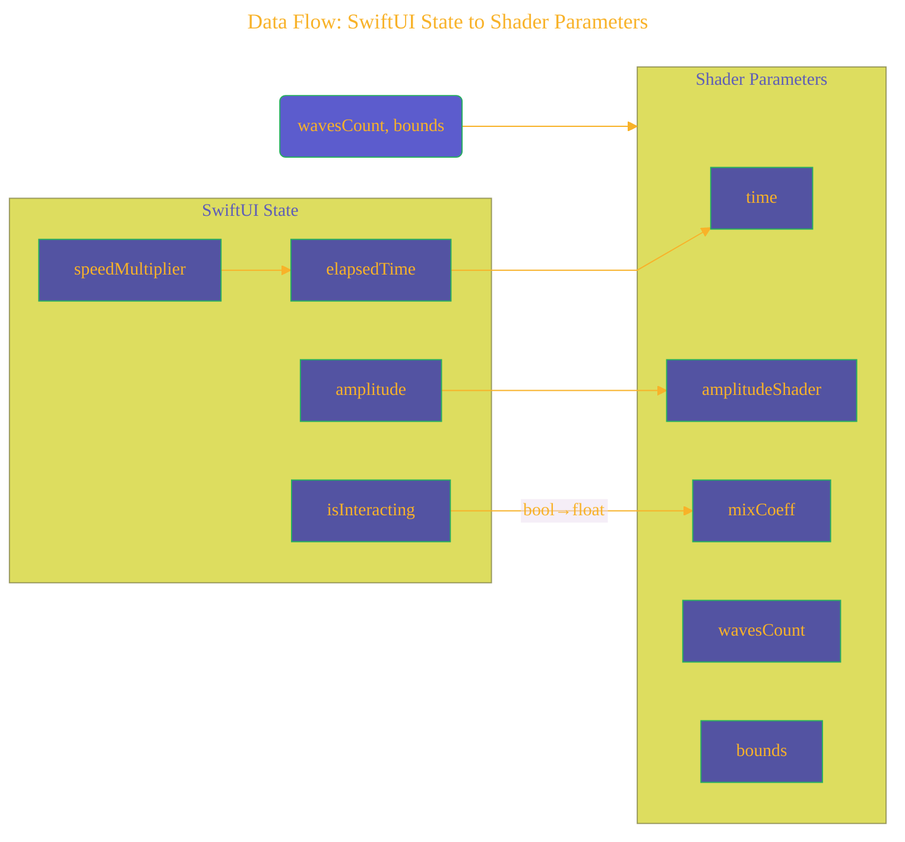

# A Diagrammatic Guide
> **Disclaimer:**
>
> This document contains my personal notes on the topic,
> compiled from publicly available documentation and various cited sources.
> The materials are intended for educational purposes, personal study, and reference.
> The content is dual-licensed:
> 1. **MIT License:** Applies to all code implementations (Swift, Mermaid, and other programming languages).
> 2. **Creative Commons Attribution 4.0 International License (CC BY 4.0):** Applies to all non-code content, including text, explanations, diagrams, and illustrations.
---


# Dynamic Harmonic Wave Effect with SwiftUI and Metal Shader: Explained Visually and Mathematically

This guide presents a comprehensive exploration of the architecture, execution flow, mathematical foundations, and state management of an interactive harmonic wave visualization implemented using SwiftUI and Metal shader programming.

---

## 1. High-Level Architecture Diagram

Below is the reiterated **High-Level Architecture** Mermaid diagram, summarizing the integration between SwiftUI and Metal.



---

## 2. Shader Function Call Hierarchy

The organization's internal breakdown showing function dependencies within the Metal shader clearly illustrated.




---

## 3. Mathematical Equations in the Metal Shader (LaTeX Syntax)

### 3.1 harmonicSDF Function

Calculates a signed distance field (SDF) for a harmonic curve:

$$
\text{harmonicSDF}(\text{uv}, a, \text{offset}, f, \phi) = \left|(uv_y - \text{offset}) + a \cdot \cos(uv_x \cdot f + \phi)\right|
$$

Where:
- $uv$ is the normalized coordinate [-0.5, 0.5].
- $a$ is amplitude.
- $\text{offset}$ shifts wave vertically.
- $f$ (frequency) dictates horizontal wave density.
- $\phi$ (phase) shifts wave horizontally along $uv_x$.

### 3.2 glow Function

Defines intensity attenuation as a function of distance ($x$) from the wave line:

$$
\text{glow}(x, \text{strength}, \text{intensity}) = \frac{\text{intensity}}{|x|^{\text{strength}}}
$$

- The intensity sharply reduces according to power law controlled by \(strength\).

### 3.3 getColor Function

Simple indexed color retrieval:

Let $t \in \mathbb{N}$, then:

$$
\text{getColor}(t) \rightarrow 
\begin{cases}
\text{Teal} & t=0\\[6pt]
\text{Purple} & t=1\\[6pt]
\text{Red-Pink} & t=2\\[6pt]
\text{Blue} & t=3\\[6pt]
\text{Cyan} & t=4\\[6pt]
\text{Brownish} & t=5\\[6pt]
\text{White} & \text{otherwise}
\end{cases}
$$

---

## 4. Detailed Shader Execution Logic Flowchart

### 4.1. `harmonicColorEffect` Shader Logic




Clearly shows shader internals: normalization, modulation, parameter interpolation, harmonic evaluation, glow calculation, color mixing, and looping.

---

## 5. SwiftUI Interaction and State Management

This diagram explicates user interaction linked flow.




The sequence highlights interactive responsiveness, direct correlation of interaction states and visual feedback.

---

## 6. Data Flow: SwiftUI State to Shader Parameters

Illustration depicting mappings from Swift state to shader params.




Clarifies clear roles of variables, including internal transformations (e.g., boolean to float interpolation coefficient).

---

## 7. Mathematical Insight (Summary)

To underline the algorithmic complexity and aesthetic novelty:

- Each wave's position is determined by harmonic oscillation functions:

$$
y(x, t) = \text{offset}(x, t) + a(x)\cos(f \cdot x + \phi(t))
$$

- The glow's intensity is inversely proportional to the distance from the curve:
$$
I(d) = \frac{k}{|d|^\gamma}, \quad (\gamma \text{ controlling sharpness})
$$

---

## Conclusion and Insights

The incorporation of SwiftUI's interaction management and Metal shader's computational efficiency provides a harmonious balance of high visual quality and performant interactivity. The mathematically well-defined functions, such as signed distance fields (SDFs), glow attenuation, and palette mapping or interpolations, provide clarity, predictability, and creative control over aesthetics.

This entire architecture results in a flexible system capable of adapting real-time visual feedback to user interactions, highlighting the synergy between declarative UI frameworks (SwiftUI) and GPU-driven shader computation (Metal).


---


```mermaid
---
title: "CongLeSolutionX"
author: "Cong Le"
version: "1.0"
license(s): "MIT, CC BY 4.0"
copyright: "Copyright (c) 2025 Cong Le. All Rights Reserved."
config:
  theme: base
---
%%%%%%%% Mermaid version v11.4.1-b.14
%%{
  init: {
    'flowchart': { 'htmlLabels': false },
    'fontFamily': 'Brush Script MT',
    'themeVariables': {
      'primaryColor': '#fc82',
      'primaryTextColor': '#F8B229',
      'primaryBorderColor': '#27AE60',
      'secondaryColor': '#81c784',
      'secondaryTextColor': '#6C3483',
      'fontSize': '20px'
    }
  }
}%%
flowchart LR
    My_Meme@{ img: "https://github.com/CongLeSolutionX/MY_GRAPHIC_ASSETS/blob/Designing_graphic_syntax/MY_MEME_ICONS/Orange-Cloud-Search-Icon-Base-Color-Black-1024x1024.png?raw=true", label: "Ăn uống gì chưa ngừi đẹp?", pos: "b", w: 200, h: 150, constraint: "on" }

    Closing_quote@{ shape: braces, label: "Math and code work together to bring interactive art to life!" }

Closing_quote --- My_Meme

```


---
**Licenses:**

- **MIT License:**  [](LICENSE) - Full text in [LICENSE](LICENSE) file.
- **Creative Commons Attribution 4.0 International:** [](LICENSE-CC-BY) - Legal details in [LICENSE-CC-BY](LICENSE-CC-BY) and at [Creative Commons official site](http://creativecommons.org/licenses/by/4.0/).

---