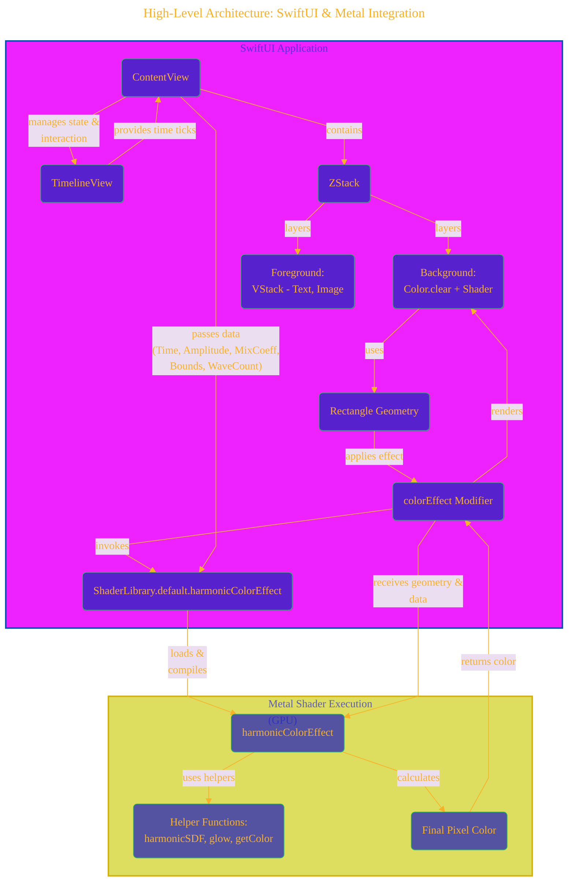
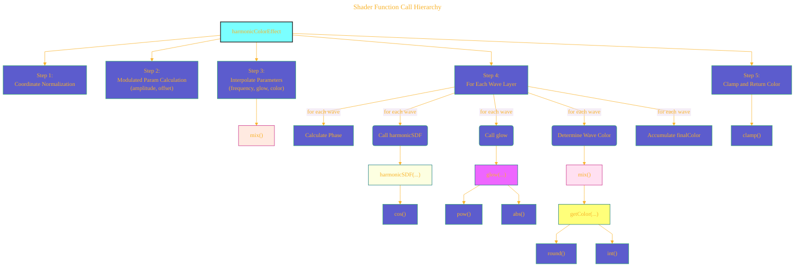
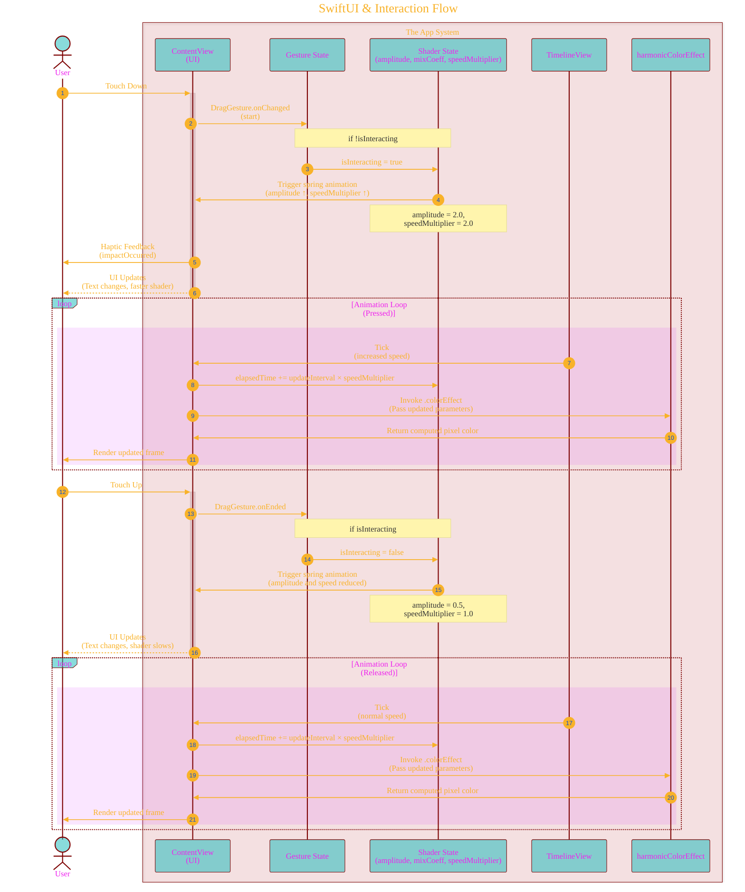
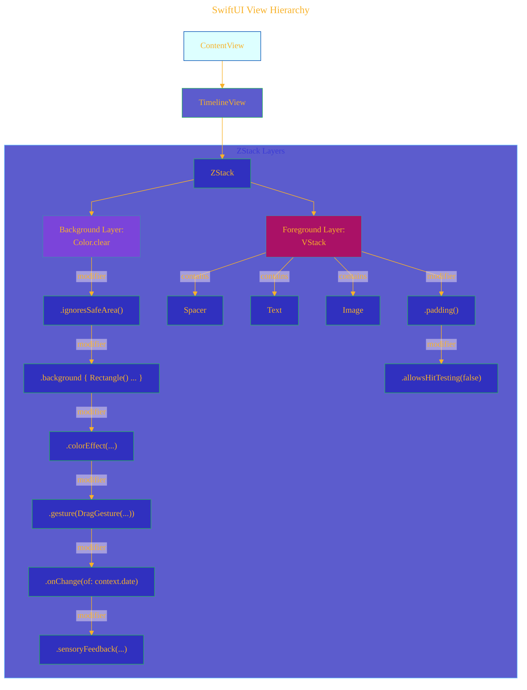
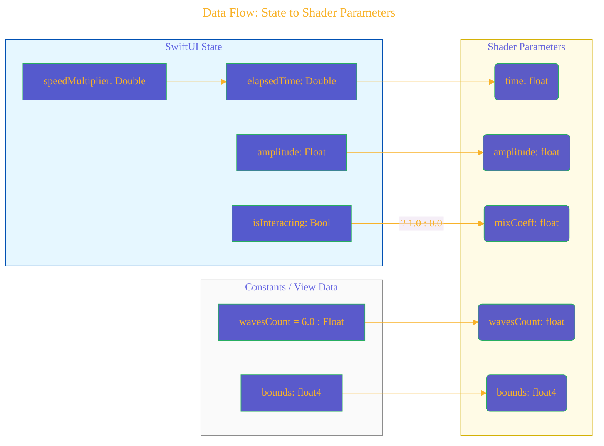

# A Diagrammatic Guide
> **Disclaimer:**
>
> This document contains my personal notes on the topic,
> compiled from publicly available documentation and various cited sources.
> The materials are intended for educational purposes, personal study, and reference.
> The content is dual-licensed:
> 1. **MIT License:** Applies to all code implementations (Swift, Mermaid, and other programming languages).
> 2. **Creative Commons Attribution 4.0 International License (CC BY 4.0):** Applies to all non-code content, including text, explanations, diagrams, and illustrations.
---


## 1. Overview of the Dynamic Harmonic Shader

This project uses a Metal shader to render a dynamic, layered harmonic wave effect that is integrated into a SwiftUI view. In summary, the application’s responsibilities are:

• **SwiftUI Layer:**  
  - Manages user interaction (press & hold), state, and animation timing.  
  - Provides the geometry and state data to the shader via a custom `.colorEffect` modifier.

• **Metal Shader Layer:**  
  - Implements functions like `harmonicColorEffect`, which combines several helper functions (such as `harmonicSDF`, `glow`, and `getColor`) to compute the final pixel color.
  - Uses mathematical operations (e.g., cosine, absolute value, power functions, interpolation) to calculate the wave curves, glow intensities, and color lookup.

---

## 2. High-Level Architecture: SwiftUI & Metal Integration

The following Mermaid diagram visually explains the overall architecture and data flow between SwiftUI and the underlying Metal shader.



### Explanation

1. **SwiftUI Layer:**  
   - The `ContentView` houses a `TimelineView` that drives the animation.
   - A `ZStack` is used to layer the background (which holds the shader via a `Rectangle` with a `.colorEffect` modifier) and a foreground containing UI elements (such as text and images).

2. **Metal Layer:**  
   - The shader function `harmonicColorEffect` is loaded and compiled.
   - Helper functions (like `harmonicSDF`, `glow`, and `getColor`) are used to build up the final pixel color that is then returned for display.

---

## 3. Shader Function Call Hierarchy

This diagram shows how the main shader function calls various helper functions to compute its result.



### Explanation

- **Coordinate Normalization:**  
  The pixel coordinates are normalized to center around (0, 0).

- **Modulated Parameter Calculation:**  
  The amplitude and offset are computed based on the x-coordinate and time.

- **Interpolation:**  
  Linear interpolation of parameters (frequency, glow width/intensity) is done with a helper mix function.

- **Loop Through Waves:**  
  For each wave layer (depending on the number of waves), the shader:
  - Calculates a phase using the global time and the layer index.
  - Computes the distance to the wave using the custom `harmonicSDF`.
  - Applies a glow effect using the `glow` function.
  - Determines the wave’s color via the `getColor` lookup.
  - Finally, each layer’s color contribution is accumulated into the final color.

- **Finalization:**  
  All accumulated colors are clamped to ensure valid RGB values and returned as the final output.

---

## 4. Mathematical Equations and Notations

The shader logic relies on several mathematical operations. Here are the key equations with LaTeX explanations:

### 4.1. Harmonic Signed Distance Function (SDF)

The `harmonicSDF` function determines the distance from a given point (uv) to the wave curve:

$$
\text{sdf} = \left| \left( uv_y - \text{offset} \right) + a \times \cos\left( uv_x \times f + \phi \right) \right|
$$

Where:
- $uv_x, uv_y$ are the normalized coordinates.
- $a$ is the modulated amplitude.
- $\text{offset}$ is the vertical displacement.
- $f$ is the frequency of the wave.
- $\phi$ is the phase shift.

This equation provides the absolute (minimum) distance from the current pixel to the computed wave curve.

---

### 4.2. Glow Effect Calculation

The glow effect is computed based on the distance using a power law:

$$
\text{glow} = \frac{ \text{dist} }{ \left| x \right|^{\text{str}} }
$$

Where:
- $x$ is the distance computed (often the SDF value).
- $\text{str}$ is the strength parameter controlling the falloff (a higher $\text{str}$ gives a tighter glow).
- $\text{dist}$ is the base intensity.

This inverse relationship ensures a brighter glow for points near the wave surface.

---

### 4.3. Parameter Interpolation Using mix()

The shader uses linear interpolation to smoothly transition between two visual states (for example, released vs. pressed):

$$
\text{param} = (1 - \alpha) \cdot p_0 + \alpha \cdot p_1
$$

Where:
- $\alpha$ is the mix coefficient (0.0 when not interacting and 1.0 when interacting).
- $p_0$ and $p_1$ are the two end values (e.g., frequencies 3.0 and 12.0).

This is implemented using Metal’s built-in function `mix()`.

---

## 5. SwiftUI & Interaction Flow

The SwiftUI view uses a `TimelineView` for updating the shader parameters dynamically. The following sequence diagram describes the interaction flow when a user presses and releases the screen.




### Explanation

- **Press Down:** The user’s touch begins the gesture. The state changes cause amplitude and speed to increase.
- **Animation Loop (While Pressed):** Time is updated faster, and parameters (such as mix coefficient) are set so that the shader produces an “active” state.
- **Release:** On touch end, the state reverts to the resting values.
- **Continuous Updates:** The shader is invoked repeatedly via the `TimelineView` ticks with updated parameters.

---

## 6. SwiftUI View Hierarchy and Data Flow

Two additional Mermaid diagrams illustrate how the view is structured and how state parameters are passed from SwiftUI to the shader.

### 6.1. SwiftUI View Hierarchy



### 6.2. Data Flow: State to Shader Parameters



### Explanation

- **SwiftUI State Variables:**  
  - `elapsedTime`, `amplitude`, and `isInteracting` drive the shader parameters.
  - The boolean `isInteracting` converts to a float value (mix coefficient) for interpolation.

- **Constants:**  
  - Fixed values like the number of waves (`wavesCount`) and geometry bounds are also passed.

- **Shader Parameters:**  
  - These values are mapped directly and passed to the `harmonicColorEffect` call by SwiftUI.

---

## 7. Concluding Remarks

This document has presented:

• A **visual hierarchy** of the SwiftUI and Metal layers using Mermaid diagrams.  
• Detailed **flowcharts** that illustrate the shader function call sequence and logic flow.  
• **LaTeX-rendered equations** explaining the mathematical foundations:
  - The **harmonicSDF** equation,
  - The **glow** intensity calculation, and
  - Linear interpolation via the **mix** function.

All together, these diagrams and equations convey the concepts and internal complexities of the dynamic harmonic visual effect implemented through SwiftUI and Metal.

---


```mermaid
---
title: "CongLeSolutionX"
author: "Cong Le"
version: "1.0"
license(s): "MIT, CC BY 4.0"
copyright: "Copyright (c) 2025 Cong Le. All Rights Reserved."
config:
  theme: base
---
%%%%%%%% Mermaid version v11.4.1-b.14
%%{
  init: {
    'flowchart': { 'htmlLabels': false },
    'fontFamily': 'Brush Script MT',
    'themeVariables': {
      'primaryColor': '#fc82',
      'primaryTextColor': '#F8B229',
      'primaryBorderColor': '#27AE60',
      'secondaryColor': '#81c784',
      'secondaryTextColor': '#6C3483',
      'lineColor': '#F8B229',
      'fontSize': '20px'
    }
  }
}%%
flowchart LR
    My_Meme@{ img: "https://github.com/CongLeSolutionX/MY_GRAPHIC_ASSETS/blob/Designing_graphic_syntax/MY_MEME_ICONS/Orange-Cloud-Search-Icon-Base-Color-Black-1024x1024.png?raw=true", label: "Ăn uống gì chưa ngừi đẹp?", pos: "b", w: 200, h: 150, constraint: "on" }

    Closing_quote@{ shape: braces, label: "Math and code work together to bring interactive art to life!" }

Closing_quote --- My_Meme

```


---
>**Licenses:**
>
>- **MIT License:**  [](LICENSE) - Full text in [LICENSE](LICENSE) file.
>- **Creative Commons Attribution 4.0 International:** [](LICENSE-CC-BY) - Legal details in [LICENSE-CC-BY](LICENSE-CC-BY) and at [Creative Commons official site](http://creativecommons.org/licenses/by/4.0/).

---